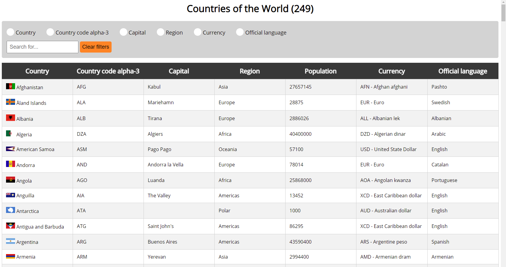

# Countries Info
Data fetched from RESTful API - https://restcountries.eu<br />
### Get the code
```
git clone https://github.com/rnycz/countries-info
```
<br />
The fetched data is displayed in the table. It is possible to filter data about a specific country.